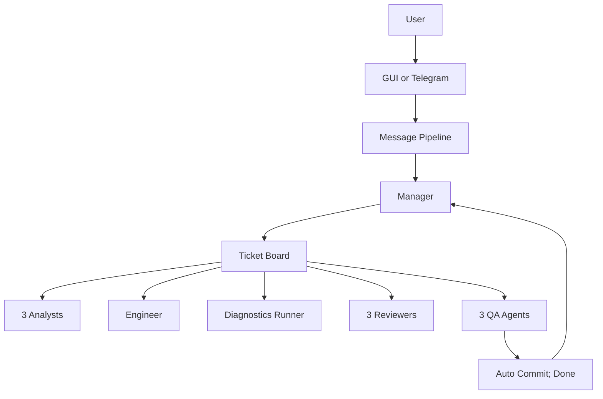

# MahBot

Mahbot is an autonomous agentic engineering system built for **reliable development with cheap models**. It treats software work as a managed pipeline, not a chat session: you talk to a **Manager** about product intent and scope; specialist agents implement, validate, and review; every change is analyzed before edits and checked again afterward. Reliability comes from **orchestration and process**, not from betting that the current frontier model will do everything right.

Mahbot packages the best agentic engineering practices into one system: role separation, subagents, persistent state, deterministic diagnostics, independent review and QA, and automatic dev loops when validation fails. It is designed to make inexpensive open-weight and API models useful through structure—not to depend on opaque usage pools or a single expensive model doing everything. Just a few months ago that would've been X times more expensive than subscription-based services, but thanks to the release of DeepSeek v4 mahbot now works on it's own codebase 24/7, spawns >1000 agents every day and this costs only about 10-15$/day.

## Getting Started

Currently there are two ways to start using mahbot:

**Install from crates.io**:

```bash
cargo install mahbot
```

OR

**Build from source**:

```bash
git clone https://github.com/edezhic/mahbot
cd mahbot
cargo run --release
```

Then run `mahbot` to start the dashboard and configure your OpenRouter key in **Settings**.

OpenRouter API key and an optional [`agent-browser`](https://www.npmjs.com/package/agent-browser) CLI are needed for full functionality — see [Prerequisites](#prerequisites) below.

## Why not just Claude Code, Codex, Pi or Cursor?

Most coding assistants optimize for **interactive pair programming**: you prompt, the model edits, you review. That works for focused tasks, but autonomous work tends to drift into low-level implementation details, skip verification, or hit subscription limits when agents run for hours. 

Also, mahbot is designed for real-world work from the ground up:

### 1. Product-focused Manager

You talk to a **Manager** that owns intent, scope, tickets, and progress—not an implementation agent that keeps derailing into low-level details. The Manager creates and refines work on a ticket board, delegates research to Analysts asynchronously via `ask`, and only escalates real product decisions to you. This allows manager to easily fit large chunks of work across many tickets into the context without compaction and remain focused on the desired goals.

### 2. Mandatory validation pipeline

Every ticket runs through a fixed lifecycle with **redundant checks**:

| Phase | What happens |
|-------|----------------|
| **Backlog → Analysis** | 3 parallel Analysts research and score the ticket |
| **Planning** | Manager notified; moves the ticket to development when ready once the scope is confirmed |
| **Ready → In development** | 1 Engineer implements using subagents when needed |
| **In diagnostics** | Discovered project commands run (format, lint, build, test) |
| **Diagnostics done → In review** | 3 parallel Reviewers (all must pass ≥ 9/10) |
| **Reviewed → In QA** | 3 parallel QA agents (all must pass ≥ 9/10) |
| **QA passed** | Auto `git commit` with the ticket's title if the tree is dirty → **Done** |

Failed review, QA, or diagnostics **bounce the ticket back to development** with pipeline priority. Circuit breakers pause a workspace if a ticket thrashes (too many comments or repeated diagnostics failures).

This matches what SOTA agentic systems are converging on: **execution-grounded verification** and separate agents for validation.

### 3. Common chat-completions economics

MahBbot talks to models through **OpenRouter** (or any OpenAI-compatible chat-completions API). You pay for tokens on models you choose—defaults lean toward inexpensive options like DeepSeek v4 Flash/Pro—with per-role overrides and provider routing in config.

That is a different economic shape from tools bundled into **$20–$200/month subscriptions** with rolling 5-hour windows, weekly caps, or agent credit pools. MahBot does not require a specific vendor subscription to be efficient; heavy use scales with API spend and orchestration design, not with upgrading a product tier.

Other harnesses efficiency heavily relies on huge discrepancy between subscription & API prices of the tokens, which is not a viable long-term strategy. On the other hand, mahbot is designed to be vendor & provider agnostic from the very beginning. 

### 4. Agentic engineering harness, built in

Instead of bolting skills, subagents, and review onto a chat UI, MahBot ships the harness:

- **Multi-role agents** — Manager, Engineer, Analyst, Coder, Reviewer, QA, Discovery, Maintainer, Artist (see `src/role.rs`)
- **Subagents** — `ask` spawns Analyst/Coder work in isolated context; Manager gets async results via a serialized queue
- **Persistent state** — Turso-backed sessions, tickets, workspace context, chat history, tool stats
- **Workspace discovery** — per-role codebase summaries + auto-detected diagnostics commands
- **Built-in dev surface** — native dashboard: chat, ticket board, editor, diff, shell, sessions, logs, tool-failure stats, settings; optional **Telegram** channel on the same pipeline
- **Background Maintainer** — scans for refactor opportunities and creates **planning tickets only** (no silent edits)
- **Archived ticket search** — hybrid FTS + local Candle + GGUF embeddings, Manager can efficiently search over all the past work

## Architecture (sketch)



- **Channels** — GUI and Telegram share one message pipeline and channel registry (`src/channels/`, `src/main.rs`).
- **Manager queue** — user messages, ticket notifications, and async `ask` results enqueue; consumer runs one job at a time (`src/manager_queue.rs`).
- **Board poller** — `management.rs` claims tickets per workspace and dispatches agents by phase.
- **Persistence** — under configurable storage root (`~/.mahbot/`): config, sessions, board, workspaces, users, stats, logs, chat history (`src/turso.rs`, module stores).
- **Search** — per-workspace `fff-search` index with persistent query boosting; archived tickets use FTS + embeddings (`src/search_engine.rs`, `src/embedder.rs`).
- **Prompts** — role, tool, discovery, and summarization prompts embedded in the binary (`src/prompt/`, `rust-embed`).

Rust **2024**, native **Iced** dashboard, **Tokio** async. Single-instance lock; graceful shutdown.

## Prerequisites

**Required:**

- OpenRouter API key (or compatible endpoint configured in settings)
- [`agent-browser`](https://www.npmjs.com/package/agent-browser) CLI (browser tool and link enrichment)

**Optional:**

- Exa API key — enables `web_search` tool
- Telegram bot token — remote chat on the same agent backend

**Defaults (configurable):** per-role models via OpenRouter; image/video generation and transcription models in settings. See `src/config.rs` and the dashboard **Settings** page.

## License

MIT OR Apache-2.0 — see `Cargo.toml`.